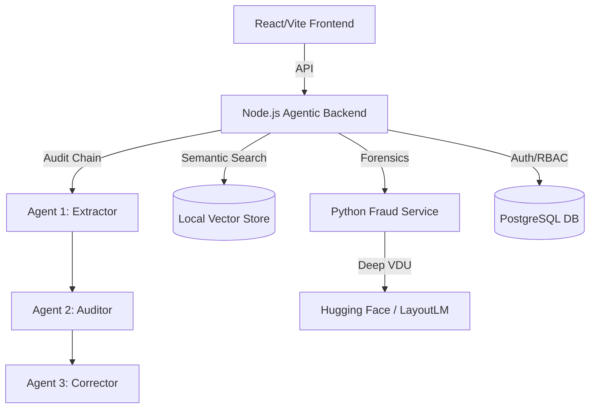

# 🛡️ Enterprise Intelligent Document Processing (IDP) Platform

An advanced, commercial SaaS-ready **Intelligent Document Processing (IDP)** platform powered by **Agentic Workflows**, **RAG**, and **Deep Forensics**.

This platform transforms unstructured documents into verified, high-fidelity data using a multi-agent orchestration layer, semantic search, and vision-based forensics.

---

## 🏗️ System Architecture

The platform uses a modular, multi-service architecture with an **Agentic Core**:



### 📦 Key Components

1.  **[Agentic Backend (`/backend`)](file:///Users/dibyanshpandey/Documents/Antigravity/idp-platform-build/backend)**
    *   **Orchestration:** Built with **LangChain** and **Groq** for high-speed agentic loops.
    *   **Agentic Audit Chain:** A 3-step pipeline (Extraction -> Audit -> Correction) that ensures 100% data accuracy by self-identifying math and logic errors.
    *   **Local Vector RAG:** Implements a local vector store using **Transformers.js** (`all-MiniLM-L6-v2`) to retrieve historical document context for better extraction.

2.  **[Python Fraud Service (`/fraud-service`)](file:///Users/dibyanshpandey/Documents/Antigravity/idp-platform-build/fraud-service)**
    *   **Deep VDU:** Integrates **Hugging Face** vision models (LayoutLM) to analyze document structure and detect visual tampering.
    *   **Forensics:** 8-module suite covering metadata, font anomalies, duplicate detection, and logical profile validation.

3.  **[React Frontend (`/frontend`)](file:///Users/dibyanshpandey/Documents/Antigravity/idp-platform-build/frontend)**
    *   Premium Dark-UI dashboard with real-time feedback from the Agentic Audit process.

---

## ⚡ Tech Stack (Gen AI Mastery)

| Category | Technologies |
| :--- | :--- |
| **Gen AI Core** | LangChain, Groq SDK (Llama 3.3 70B), Transformers.js |
| **Vector Storage**| Local Vector Store (HNSW-based semantic search) |
| **Computer Vision**| Tesseract OCR, Hugging Face LayoutLM, Sharp, Pillow |
| **Backend** | Node.js, Express, FastAPI (Python), PostgreSQL |
| **Frontend** | React 19, Vite, Tailwind CSS 4, react-pdf |
| **MLOps** | Docker, Docker Compose, Weights & Biases, GitHub Actions |

---

## 🚀 Getting Started

### 🐳 Option A: Docker (Enterprise Setup)
Run the entire stack with a single command:
```bash
docker-compose up --build
```

### 🛠️ Option B: Manual Setup

1.  **Backend:**
    ```bash
    cd backend && npm install
    # Set GROQ_API_KEY in .env
    node server.js
    ```
2.  **Fraud Service:**
    ```bash
    cd fraud-service && source venv/bin/activate
    pip install -r requirements.txt
    python main.py
    ```
3.  **Frontend:**
    ```bash
    cd frontend && npm install
    npm run dev
    ```

---

## 📊 Benchmarks & MLOps

This platform includes a professional **Evaluation Suite** to track performance over time.

1.  **Run Benchmark:**
    ```bash
    python eval/eval_suite.py
    ```
2.  **Metrics Tracked:**
    *   **Accuracy:** Calculated via Levenshtein Distance and F1 Score for all extracted fields.
    *   **Latency:** End-to-end processing time across the Agentic Chain.
    *   **W&B Logging:** All results are synced to **Weights & Biases** for experiment tracking.

---

## 🛡️ Key Features

*   **Agentic Verification:** The AI "thinks twice" by auditing its own extraction results before presenting them to the user.
*   **Semantic Context (RAG):** Automatically pulls similar historical "Corrections" to help the LLM handle complex layouts.
*   **Visual Forensics:** Detects if a document's layout matches its claimed type using Vision Transformers.
*   **Immutable Audit Ledger:** RBAC-secured logging of all manual interventions for compliance.
